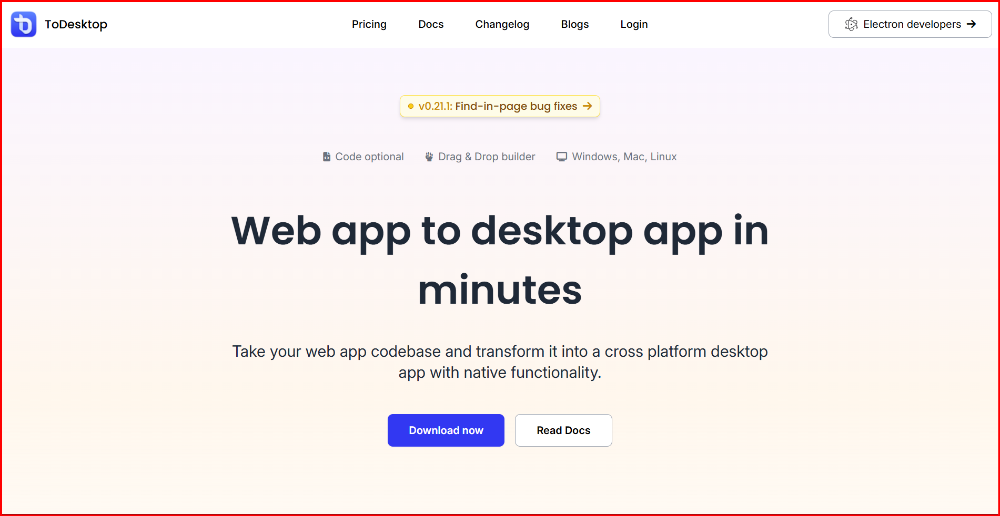
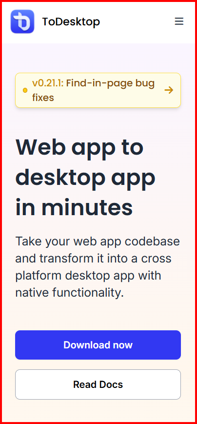

# ToDesktop Clone 🖥️

A pixel-perfect UI clone of [ToDesktop](https://www.todesktop.com/) — built as a frontend practice project. Fully responsive with subtle animations and a marquee-style scrolling section.

 
<!-- Replace with an actual screenshot -->

## 🔗 Live Demo

👉 [to-desktop-clone-lemon.vercel.app](https://to-desktop-clone-lemon.vercel.app/)

---

## ✨ Features

- Pixel-perfect clone of the ToDesktop landing page
- Fully responsive across mobile, tablet, and desktop
- Subtle CSS animations for a polished feel
- Marquee-style scrolling elements
- Clean semantic HTML structure

---

## 🛠️ Built With

- HTML5
- CSS3
- JavaScript
- [Tailwind CSS](https://tailwindcss.com/)

---

## 📁 Project Structure

```
ToDesktop-Clone/
├── assets/          # Images and static files
├── index.html       # Main HTML file
├── output.css       # Compiled Tailwind CSS
├── style.css        # Custom styles
├── script.js        # JavaScript
├── tailwind.config.js
└── package.json
```

---

## 🚀 Getting Started

### Prerequisites
- Node.js installed

### Installation

```bash
# Clone the repo
git clone https://github.com/Prashant-marathe/ToDesktop-Clone.git

# Navigate into the project
cd ToDesktop-Clone

# Install dependencies
npm install
```

### Running Locally

```bash
# Start Tailwind watcher
npx tailwindcss -i ./style.css -o ./output.css --watch
```

Then open `index.html` in your browser using Live Server or:

```bash
npx serve .
```

---

## 📸 Screenshots

<!-- Add your screenshots below -->
| Desktop View | Mobile View |
|---|---|
|  |  |

---

## 👤 Author

**Prashant Marathe**
- GitHub: [@Prashant-marathe](https://github.com/Prashant-marathe)

---

## 📝 License

This project is for educational purposes only. ToDesktop is a product of [ToDesktop Ltd](https://www.todesktop.com/).